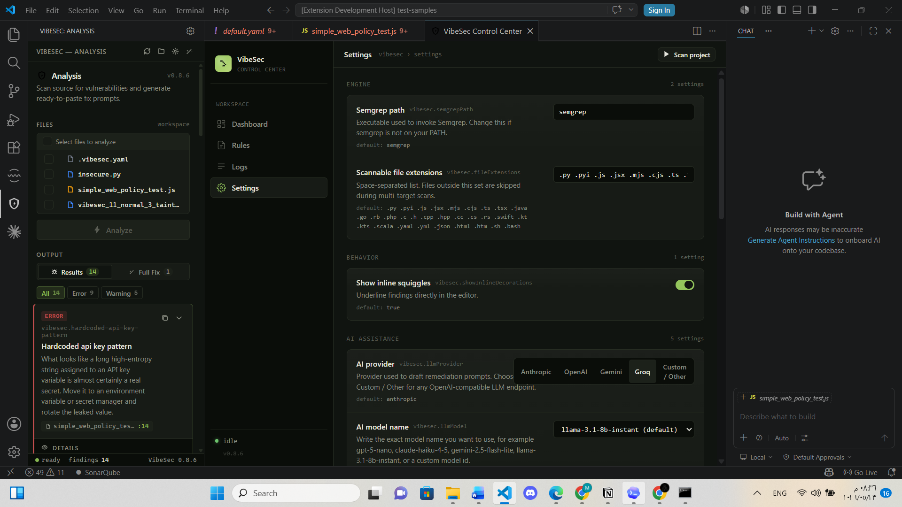

# VibeSec

[](https://github.com/m2004266/vibesec/actions/workflows/ci.yml)
[](LICENSE)

VibeSec is a local-first VS Code security extension that brings Semgrep-powered static analysis, policy management, taint-analysis rules, and AI-ready remediation prompts into the developer workflow.

Main idea: Security across every phase of the software development lifecycle.

The project is built as a production-style extension: TypeScript extension host code, React webviews, bundled Semgrep rule packs, Docker scanner support, CI, release packaging, tests, and Marketplace-ready metadata.

Repository: <https://github.com/m2004266/vibesec>

## Highlights

| Area | What VibeSec Shows |
| --- | --- |
| Extension engineering | VS Code commands, webviews, activity-bar views, diagnostics, settings, SecretStorage, and workspace file operations |
| Security tooling | Local Semgrep scans, policy-driven rule selection, severity filtering, taint rules, and inline diagnostics |
| Product UX | Analysis sidebar, Control Center dashboard, scan history, logs, rule inventory, and prompt-generation flows |
| AI integration | OpenAI, Anthropic, Gemini, Groq, and custom OpenAI-compatible provider support for fix prompts |
| DevOps polish | GitHub Actions, npm tests, dependency audit, VSIX file audit, Docker image flow, and release checklist |
| Privacy posture | No scanner account, no telemetry, no cloud backend; optional API keys stay in VS Code SecretStorage |

## Screenshots

### Control Center Dashboard


### Analysis Panel and Fix Prompts



### Command Palette


## What It Does

1. Run `VibeSec: Scan Current File`, `VibeSec: Scan Whole Project`, or right-click files/folders and run `VibeSec: Scan Selected`.
2. VibeSec runs Semgrep locally against bundled or workspace-selected policies.
3. Findings appear in the VibeSec Analysis sidebar and as inline diagnostics in the editor.
4. The Control Center exposes dashboards, settings, logs, scan history, and rule inventory.
5. Optional AI prompt generation creates copy-paste remediation prompts per finding, file, or project.

## Quick Start

```bash
git clone https://github.com/m2004266/vibesec.git
cd vibesec
npm ci
npm run compile
```

Open the repository in VS Code and press `F5` to launch an Extension Development Host. In the new window, open a source file and run `VibeSec: Scan Current File`.

Install Semgrep for extension scans:

```bash
pip install semgrep
semgrep --version
```

## Run With Docker

Use the Docker scanner when you want zero host setup for Semgrep:

```bash
docker run --rm -v "$PWD:/workspace" ghcr.io/m2004266/vibesec:latest
```

PowerShell:

```powershell
docker run --rm -v "${PWD}:/workspace" ghcr.io/m2004266/vibesec:latest
```

For local image development:

```bash
npm run docker:build
docker run --rm -v "$PWD:/workspace" vibesec:local
```

The image scans `/workspace` by default, uses `.vibesec.yaml` when present, and exits `1` when findings are detected. See [docs/docker.md](docs/docker.md) for JSON output, exit codes, and publishing notes.

## Core Features

| Feature | Details |
| --- | --- |
| Local scans | Current file, selected files/folders, or whole-workspace scans |
| Policy control | `.vibesec.yaml`, bundled `vibesec:default` and `vibesec:taint` presets, and custom Semgrep-shaped rules |
| Finding workflow | Severity filters, click-to-jump navigation, copyable descriptions, and inline squiggles |
| Control Center | Dashboard, settings, logs, scan history, rule inventory, YAML open actions |
| Taint analysis | Source-to-sink tracking for command injection, SQL injection, path traversal, deserialization, XSS, and SSRF |
| Fix prompts | Per-finding, per-file, and project-level AI remediation prompts |
| Release hygiene | CI compile/test/audit checks, VSIX file audit, Docker build path, and tag-based release workflow |

## Commands

| Command | Description |
| --- | --- |
| `VibeSec: Scan Current File` | Scan the active editor file |
| `VibeSec: Scan Selected` | Scan files or folders selected from Explorer |
| `VibeSec: Scan Whole Project` | Scan every supported file in the workspace |
| `VibeSec: Open Control Center` | Open Dashboard, Settings, Logs, and Rules |
| `VibeSec: Open Policy File` | Create or open `.vibesec.yaml` in the workspace root |
| `VibeSec: Reload Policy` | Reload policy configuration from disk |
| `VibeSec: Set API Key` | Store an AI provider key securely |
| `VibeSec: Clear API Key` | Remove the stored key |
| `VibeSec: Test API Key` | Validate the configured provider, endpoint, model, and key |
| `VibeSec: Generate Prompts` | Generate AI repair prompts for current findings |

## Policy File

Create `.vibesec.yaml` in the workspace root.

Selector policy:

```yaml
activePolicyFiles:
  - rules/default.yaml
  - rules/taint.yaml
```

Direct policy:

```yaml
presets:
  - vibesec:default
  - vibesec:taint

severity:
  minSeverity: warning

files:
  exclude:
    - "**/node_modules/**"
    - "**/*.test.ts"

rules:
  - id: local.no-eval
    message: "Do not execute user-controlled code."
    severity: ERROR
    languages: [javascript, typescript]
    pattern: eval(...)
```

Use `VibeSec: Open Policy File` to create a starter policy and `VibeSec: Reload Policy` after editing it.

## AI Fix Prompts

VibeSec can build remediation prompts for Cursor, Claude Code, ChatGPT, or another coding assistant. Generated prompts include exact file paths, line numbers, rule IDs, severity labels, snippets, taint flow when available, and verification expectations.

Supported providers:

- OpenAI
- Anthropic
- Google Gemini
- Groq
- Custom OpenAI-compatible endpoints

One-time setup:

1. Run `VibeSec: Set API Key`.
2. Pick the provider and store the key in VS Code SecretStorage.
3. Configure `vibesec.llmProvider`, `vibesec.llmModel`, and optional custom endpoint settings from the Control Center or VS Code settings.
4. Run `VibeSec: Generate Prompts`, then copy per-finding, per-file, or project-level prompts from the Analysis panel.

## Development Scripts

| Script | Purpose |
| --- | --- |
| `npm run compile` | Type-check extension code and rebuild bundled webview assets |
| `npm test` | Compile and run Node test suites |
| `npm run audit` | Run `npm audit --audit-level=moderate` |
| `npm run package:ls` | Compile and list files that will be included in the VSIX |
| `npm run package:vsix` | Compile and create a local `.vsix` package |
| `npm run docker:build` | Build the local zero-dependency scanner image as `vibesec:local` |
| `npm run release:dry-run` | Run tests, audit, and VSIX file audit |
| `npm run release:vsix` | Run tests, audit, and create a VSIX |

## CI and Release

Every push and pull request runs:

- `npm ci`
- `npm test`
- `npm run audit`
- `npm run package:ls`

Tag pushes matching `v*.*.*` run the release workflow, build a VSIX, upload it as a workflow artifact, and attach it to the matching GitHub release.

See [docs/release-checklist.md](docs/release-checklist.md) for the release checklist.

## Project Structure

```text
vibesec/
|-- src/                     Extension activation, scanner, policy, logs, panel, Control Center
|-- design/                  React source for Analysis panel and Control Center
|-- media/                   Activity-bar icon, walkthrough Markdown, built design bundles
|-- rules/                   Bundled Semgrep policy files
|-- test/                    Node test suites for release-critical behavior
|-- test-samples/            Intentionally vulnerable sample project files
|-- docs/                    Screenshots, release documentation, rule references
|-- .github/workflows/       CI and release automation
|-- Dockerfile               Zero-dependency scanner image with Semgrep bundled
|-- package.json             VS Code extension manifest and scripts
|-- package-lock.json        Locked npm dependency graph
|-- README.md                User and contributor documentation
```
